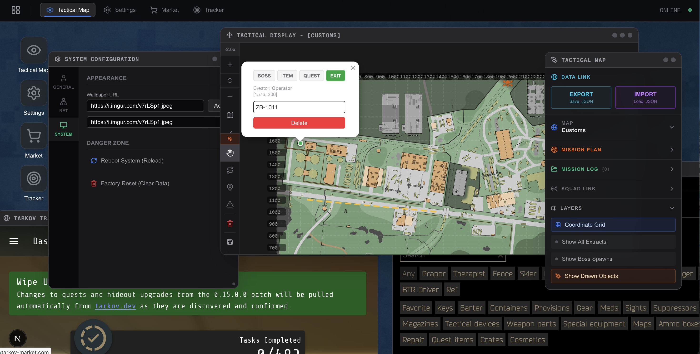

# ❖ Tarkov Operating System
### Web-Based Tactical Command Interface // Ver. 0.1.0-alpha

<div align="left">


<br/>

> ** SYSTEM ALERT**
>
> You are accessing the **TerraGroup Remote Terminal**.
> This interface simulates a tactical desktop environment directly in your browser.
> *Initialize Protocol...*

</div>

---

## Preview



---

## Overview

**Tarkov Operating System (TOS)** is a web-based **Desktop Environment Simulation** built for *Escape from Tarkov* players. It consolidates mapping, mission planning, and tactical tools into a window-based interface that feels like a real Operating System.

Instead of Alt-Tabbing between static web pages, treat TOS as your **Second Monitor Battle Station**.

---

## Legal & Intellectual Property

This project respects both the game developer's rights and the open-source community.

### 1. Source Code: GNU AGPL v3
The code logic (React/Next.js architecture) is licensed under the **GNU Affero General Public License v3.0**.
- ✅ **Freedom**: You can modify, distribute, and use this code commercially.
- 🔄 **Disclosure**: If you host this as a service, you must share your source code.
- See [LICENSE](./LICENSE) for details.

### 2. Assets & Copyright Disclaimer
This is a **fan-made application** and is strictly **non-commercial** regarding game assets.

- **Game Intellectual Property**: *Escape from Tarkov*, *TerraGroup*, and all related logos, lore, and icons are trademarks of **Battlestate Games Limited**. This project is not affiliated with Battlestate Games.
- **Community Assets**: Map images are sourced from the **Official Escape from Tarkov Wiki**.
  - Map Data Credits: Provided by Tarkov Wiki Community (Created by various contributors including *Jindouz*, *re3mr*, etc.).
- **Usage Policy**: These assets are used under the principles of **Fair Use** and the [Battlestate Games Fan Content Policy](https://www.escapefromtarkov.com/). You may **NOT** use the map images or game assets for commercial purposes (e.g., selling access) without explicit permission from the rights holders.

---

## ⚡ Key Features

### Desktop Experience
- **Window Management**: Fully functional window system (Drag, Resize, Minimize, Maximize) powered by `react-draggable` and custom hooks.
- **State Persistence**: Remembers your window positions and sizes even after a reboot.
- **Responsive Grid**: Desktop icons automatically arrange themselves based on screen size.
- **Immersive UI**: Boot sequences, login screens, and tactical aesthetics inspired by military interfaces.

### Tactical Map Viewer (`BMS`)
- **High-Fidelity Maps**: Supports 4K+ resolution tactical maps (Customs, Woods, etc.).
- **Interactive Controls**:
  - **Full Screen Mode**: Zero-distraction map view.
  - **Vector Drawing**: Plan routes and mark danger zones with `Leaflet-Geoman`.
- **Ops Controller**: A floating, always-on-top mission control panel for managing spawn points and extract goals.

### System Tools
- **App Registry**: Scalable architecture to easily add new "Apps" (Windows).
- **Settings**: Manage user profiles, wallpapers, and system data.
- **Browser**: Built-in iframe browser for quick access to Tarkov Market/Tracker.

---

## Tech Stack

| Category | Technology | Description |
| :--- | :--- | :--- |
| **Framework** | **Next.js 16** | App Router, Server Components |
| **UI Engine** | **React 19** | Latest Hooks, Concurrent Features |
| **Styling** | **Tailwind CSS v4** | Zero-runtime styling |
| **State** | **Zustand** | Global store for Window/Map state |
| **Mapping** | **React-Leaflet** | Interactive map engine |
| **Windowing** | **React-Draggable** | Desktop window simulation |

---

## Getting Started

### Prerequisites
* Node.js (v18 or higher)
* npm, yarn, or pnpm

### Installation

1. **Clone the repository:**

   ```bash
   git clone https://github.com/hwan001/Tarkov-Ops.git
   cd tarkov-ops
   ```

2. **Install dependencies:**

   ```bash
   npm install
   ```


3. **Run Development Server:**

   ```bash
   npm run dev
   ```


4. **Access the Terminal:**
   
   Open [http://localhost:3000](http://localhost:3000) in your browser. 


## Project Structure
```bash
tarkov-ops/
├── app/
│ └── page.tsx # Desktop Entry Point (Wallpaper, Icons)
├── components/
│ ├── MapViewer.tsx # Window Container for Map
│ ├── TarkovMap.tsx # Leaflet Map Engine Wrapper
│ ├── OpsController.tsx # Floating Mission Control Panel
│ ├── MapEditor.tsx # Drawing Logic (Geoman)
│ └── AppIcon.tsx # Desktop Launcher Icons
├── store/
│ ├── useMapStore.ts # Global State for Map (Zustand)
│ └── useUIStore.ts # Global State for Desktop UI (Zustand)
├── public/
│ ├── maps/ # Game Map Images (4K+ Resolution)
│ └── marker/ # Tactical Markers (SVG)
```

---

<div align="center">
   <i>"Knowledge is the key to survival."</i> - TerraGroup
</div> 
